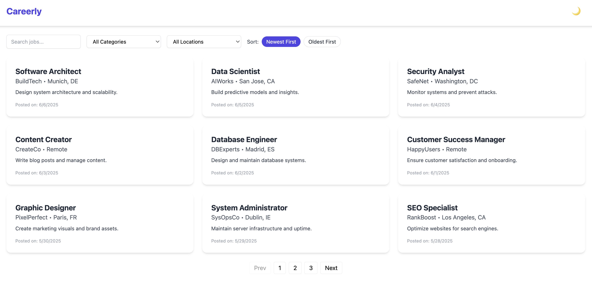

# 💼 Careerly – Modern Job Board Platform

**Careerly** is a sleek, responsive, and feature-rich job board built with Vue 3, TypeScript, Tailwind CSS, and Pinia. It allows users to browse, search, filter, and sort job listings with an intuitive interface and dark mode support.

---

## 🚀 Features

- 🔎 **Search by title or company**
- 🏷️ **Filter by category**
- 🌍 **Filter by location**
- 📅 **Sort by date** (Newest / Oldest)
- 🌑 **Dark mode toggle** with persistent theme
- 🖼️ **Detailed job view**
- 📄 **Paginated listings**
- ⚡ Built with **Vue 3 + TypeScript + Pinia + Tailwind CSS**
- 📱 Fully responsive design

---

## 📸 Preview



---

## 📦 Tech Stack

- **Vue 3 + `<script setup>`**
- **TypeScript**
- **Pinia** (State Management)
- **Vue Router**
- **Tailwind CSS** (Utility-first CSS)
- **Dark Mode** support via Tailwind + class strategy
- **Mock Data** via local `JSON` file

---

## ⚙️ Project Setup

```bash
SSH: git clone git@github.com:ezgiozdogan/careerly-job-board-app.git
HTTPS: https://github.com/ezgiozdogan/careerly-job-board-app.git
cd careerly-job-board-app
npm install
npm run dev

```


## 🧪 Linting & Formatting

npm run lint         # Check lint issues
npm run format       # Format code using Prettier


## 🗂️ Project Structure

src/
├── assets/               # Static assets
├── components/           # Reusable components (JobCard, Header, etc.)
├── data/                 # Mock job data (JSON)
├── pages/                # Route-based views
├── router/               # Vue Router setup
├── stores/               # Pinia stores
├── App.vue               # Root app shell
├── main.ts               # Entry point


## 🌙 Dark Mode
Dark mode is toggleable via the header icon. The preference is saved in localStorage and persists across sessions.

## 📄 License
This project is open source and available under the MIT License.

## 🙋‍♀️ Author
Made with ❤️ by Ezgi – frontend developer & coffee enthusiast ☕


