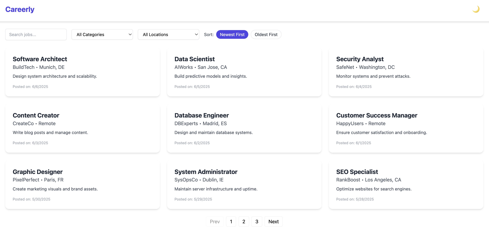

# 💼 OurJobsBoard – Modern Job Board Platform

**OurJobsBoard** is a sleek, responsive, and feature-rich job board built with Vue 3, TypeScript, Tailwind CSS, and Pinia. It allows users to browse, search, filter, and sort job listings with an intuitive interface and dark mode support.

---

## 🚀 Features

- 🔎 **Search by title or company**
- 🏷️ **Filter by category**
- 🌍 **Filter by location**
- 📅 **Sort by date** (Newest / Oldest)
- 🌑 **Dark mode toggle** with persistent theme
- 🖼️ **Detailed job view**
- 📄 **Paginated listings**
- ⚡ Built with **Vue 3 + TypeScript + Pinia + Tailwind CSS**
- 📱 Fully responsive design

---

## 📸 Preview



---

## 📦 Tech Stack

- **Vue 3 + `<script setup>`**
- **TypeScript**
- **Pinia** (State Management)
- **Vue Router**
- **Tailwind CSS** (Utility-first CSS)
- **Dark Mode** support via Tailwind + class strategy
- **Mock Data** via local `JSON` file

---

## ⚙️ Project Setup

```bash
SSH: git clone git@github.com:ezgiozdogan/our-jobs-board-app.git
HTTPS: https://github.com/ezgiozdogan/our-jobs-board-app.git
cd our-jobs-board-app
npm install
npm run dev

```

## 🧪 Testing
This project uses Vitest and @testing-library/vue for unit testing.

Run All Tests

```
npx vitest
```

Run in watch mode

```
npx vitest --watch
```
Make sure to install dependencies first:


```
npm install
```
Test files are located next to components in __tests__ folders or in *.spec.ts files.


## 🧪 Linting & Formatting

Check lint issues

```npm run lint``` 

Format code using Prettier

``` npm run format ```


## 🗂️ Project Structure

```plaintext
src/
├── assets/               # Static assets
├── components/           # Reusable components (JobCard, Header, etc.)
├── data/                 # Mock job data (JSON)
├── pages/                # Route-based views
├── router/               # Vue Router setup
├── stores/               # Pinia stores
├── App.vue               # Root app shell
├── main.ts               # Entry point
```


## 🌙 Dark Mode
Dark mode is toggleable via the header icon. The preference is saved in localStorage and persists across sessions.

## 🙋‍♀️ Author
Made with ❤️ by Ezgi – frontend developer & coffee enthusiast ☕

##
**Note:** All job listings and company names in this project are fictional and generated for demonstration purposes only.
